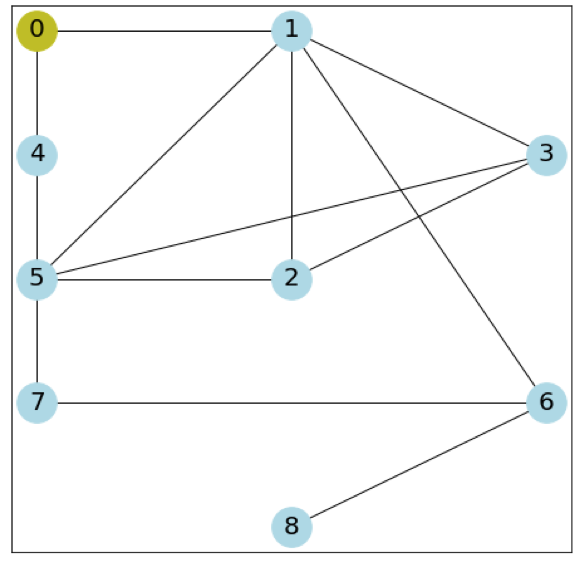
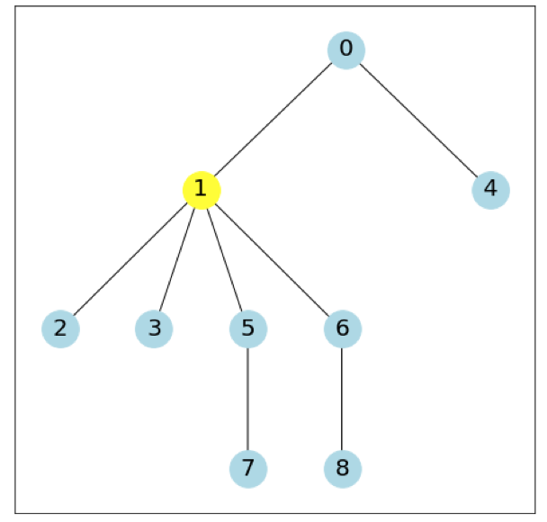
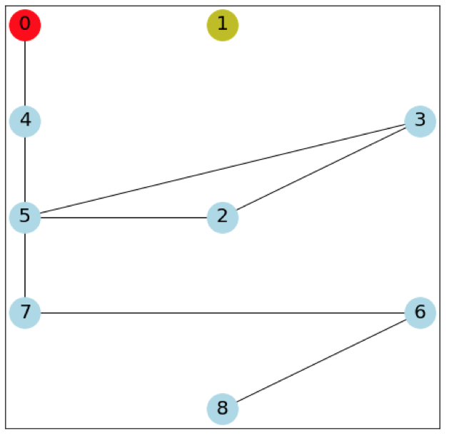
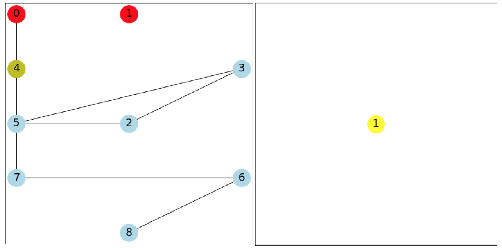
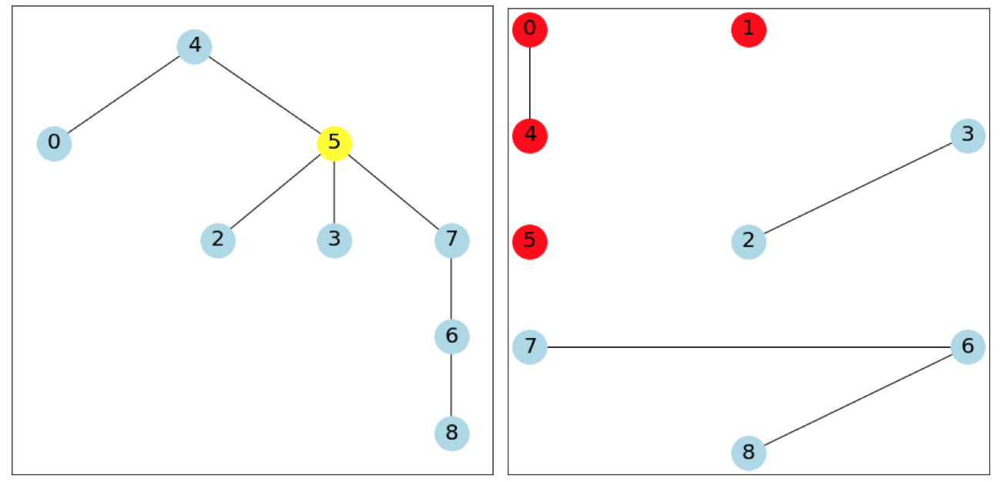

# Contact-Tracing-Simulation
The objective of this project is to design an object-oriented system, implemented with C++ while using classes, standard data structures and unique C++ properties such as the “Rule of 5”. handling memory in C++ and avoid memory leaks.

<h3>Compiler commands must include the following flags:</h3>

  
    -g -Wall -Weffc++ -std=c++11.
  

### Configuration file format

The configuration file is given in a JSON format, and it contains a dictionary (hash map) with the following entries:

<h3>Graph</h3>  The graph is given as an adjacency matrix.

<h3>Agents</h3>  A list of agents, each given as a pair of a string ("V" for virus, "C" for contact tracer) and the index of node (Which would be -1 for contact tracers, since they don't occupy a node in the graph).

<h3>Tree</h3>  The type of the trees to be constructed during the session, given as a string, "C" for cycle, "M" for max-rank, and "R" for root.

<h3>JSON format</h3>In order to read JSON format with C++,I supplied you with Niels Lohman's JSON for Modern C++. You can see how to use this package, and check examples here:
https://github.com/nlohmann/json

### Running Example

Consider the following graph, with a single virus in node 0, and a single contact tracer, using MaxRank trees. Blue nodes are healthy, yellow nodes carry a virus, and red nodes are sick.

In the first iteration, the virus infects node 0, and spreads itself to node 1. The contact tracer, polls the node 0 from the infected queue, and creates a MaxRankTree whose root is the node 0.

The node 1 is chosen, since it has the maximal rank, and hence all the edges incident to it are removed from the graph. After the first iteration, we obtain the following graph:

In the second iteration, the first virus spreads itself to node 4. The virus in node 1 infects node 1, but cannot spread itself further, since 1 is disconnected from the graph. Note that in this iteration the contact tracer does nothing, as it appears before the virus (1) in the agents list, and the infection queue is still empty when it's his turn to act.

In the third iteration, the contact tracer polls 1 from the infection queue, creates a BFS tree from 1 (Which contains only 1), and thus disconnects 1 from the graph (Which does nothing at that point). Then, 4 is infected, and the virus also spreads itself to node 5.

In the fourth iteration, the contact tracer polls 4 from the infection queue, and creates a MaxRankTree from it. It decides to disconnect 5 from the graph, as it has the maximal rank. Then, the virus infects 5, but it cannot spread itself any further. The program now terminates, as the termination conditions are satisfied. Each connected component is either fully infected, or doesn't have a virus in it.

 
